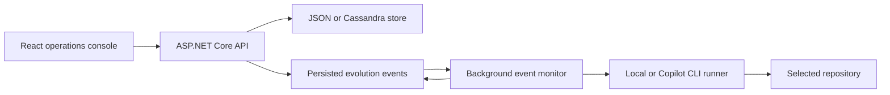

# Code Evolver Architecture

## Runtime flow

Each evolution is an aggregate containing its input, status, work items, and append-only event history. The store claims one pending event, marks it processing, and the monitor dispatches it to the configured agent runner. A successful phase appends its completion event and the next start event. Failures are persisted on both the event and aggregate.

## Lifecycle

`evolution.started` -> `scan` -> `plan` -> `work-item` -> `review` -> `gate` -> `change.merged`

Planning is limited to five work items. Stop cancels pending events. Completed and failed evolutions are terminal unless explicitly restarted after a failure or stop.

## Adapters

- `JsonEvolutionStore`: durable, zero-infrastructure local development.
- `CassandraEvolutionStore`: Docker/production storage selected with `Storage:Provider=cassandra`.
- `LocalAgentRunner`: deterministic lifecycle demonstration and tests.
- `CopilotAgentRunner`: standalone GitHub Copilot CLI automation selected with `Agent:Provider=copilot`.

The protected `HumanDesign` folder is an input-only boundary and is not modified by the application or implementation.